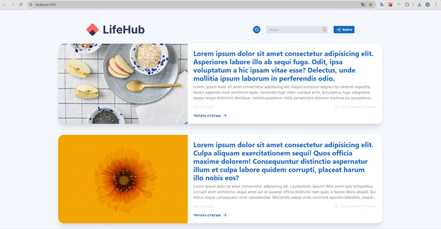
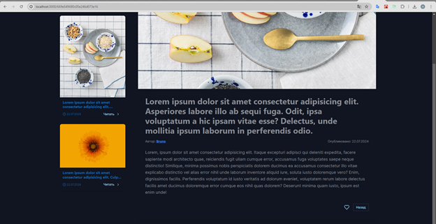
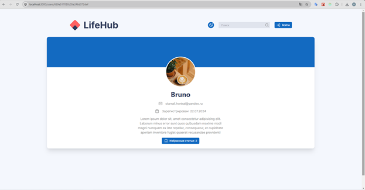
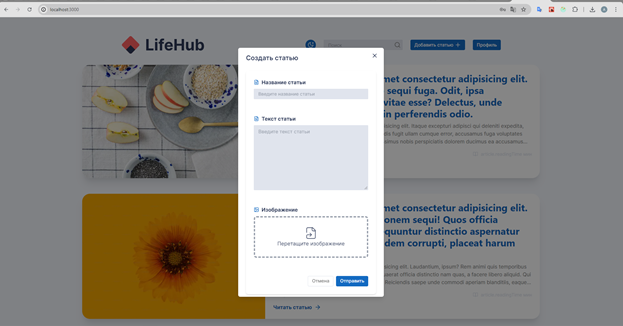

# LifeHub

LifeHub - это современный новостной портал, разработанный для создания и публикации статей и новостей. Проект использует передовые веб-технологии для обеспечения быстрой и эффективной работы.



## Технологии

- [Next.js](https://nextjs.org/) - для оптимизированного рендеринга и маршрутизации
- [TanStack Query (React Query)](https://tanstack.com/query/latest) - для эффективного управления состоянием и кэширования данных
- [TypeScript](https://www.typescriptlang.org/) - для улучшения типобезопасности и поддержки кода
- [React Hook Form](https://react-hook-form.com/) - для управления формами
- [Tailwind CSS](https://tailwindcss.com/) и [Chakra UI](https://chakra-ui.com/) - для создания адаптивного и эстетичного пользовательского интерфейса

## Установка и запуск

1. Клонируйте репозиторий:

```bash
git clone https://github.com/ArtemMazin/blog
```

2. Перейдите в директорию проекта:

```bash
cd blog
```

3. Установите зависимости:

```bash
npm install
```

4. Запустите проект в режиме разработки:

```bash
npm run dev
```

5. Откройте [http://localhost:3000](http://localhost:3000) в вашем браузере, чтобы увидеть результат.

## Скриншоты

<details>
<summary>Нажмите, чтобы увидеть больше скриншотов</summary>






</details>
