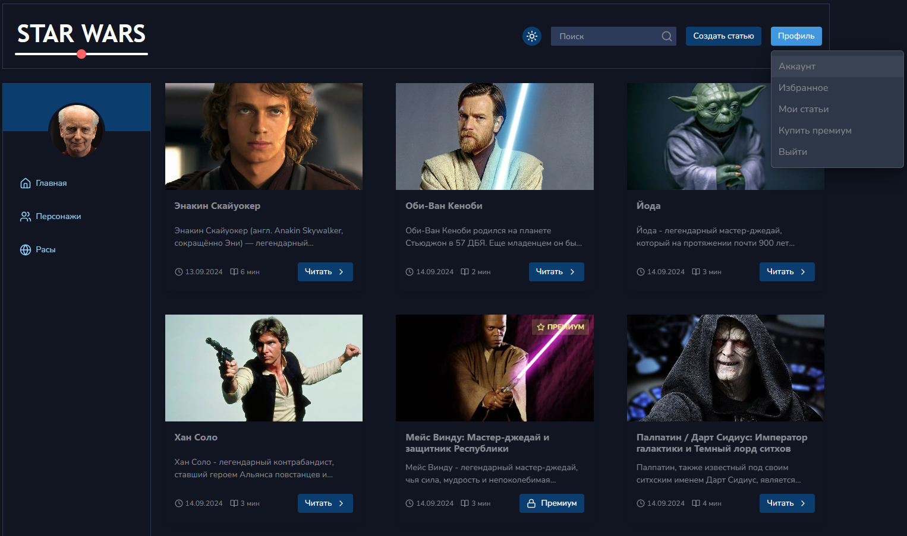

# StarWars

StarWars - это интерактивная платформа для фанатов вселенной Звездных Войн, где пользователи могут создавать и читать статьи о расах и персонажах из этой легендарной саги. Проект разработан с использованием современных веб-технологий для обеспечения быстрой и эффективной работы.


## Особенности

- Создание и чтение статей о расах и персонажах из вселенной Звездных Войн
- Система регистрации пользователей
- Премиум-подписка для доступа к эксклюзивному контенту
- Просмотр профилей авторов статей

## Технологии

- [Next.js](https://nextjs.org/) - для оптимизированного рендеринга и маршрутизации на фронтенде
- [Nest.js](https://nestjs.com/) - для создания эффективного и масштабируемого серверного приложения
- [MongoDB](https://www.mongodb.com/) - для хранения данных
- [TypeScript](https://www.typescriptlang.org/) - для улучшения типобезопасности и поддержки кода

## Установка и запуск

1. Клонируйте репозиторий:

```bash
git clone https://github.com/ArtemMazin/blog
```

2. Перейдите в директорию проекта:

```bash
cd blog
```

3. Установите зависимости:

```bash
npm install
```

4. Настройте переменные окружения:
   NEXT_PUBLIC_API_URL
   NEXT_PUBLIC_IMAGE_URL

5. Запустите сервер:

```bash
npm run dev
```

6. Откройте http://localhost:3000 в вашем браузере, чтобы увидеть результат.

## Скриншоты

<details>
<summary>Нажмите, чтобы увидеть больше скриншотов</summary>





</details>
